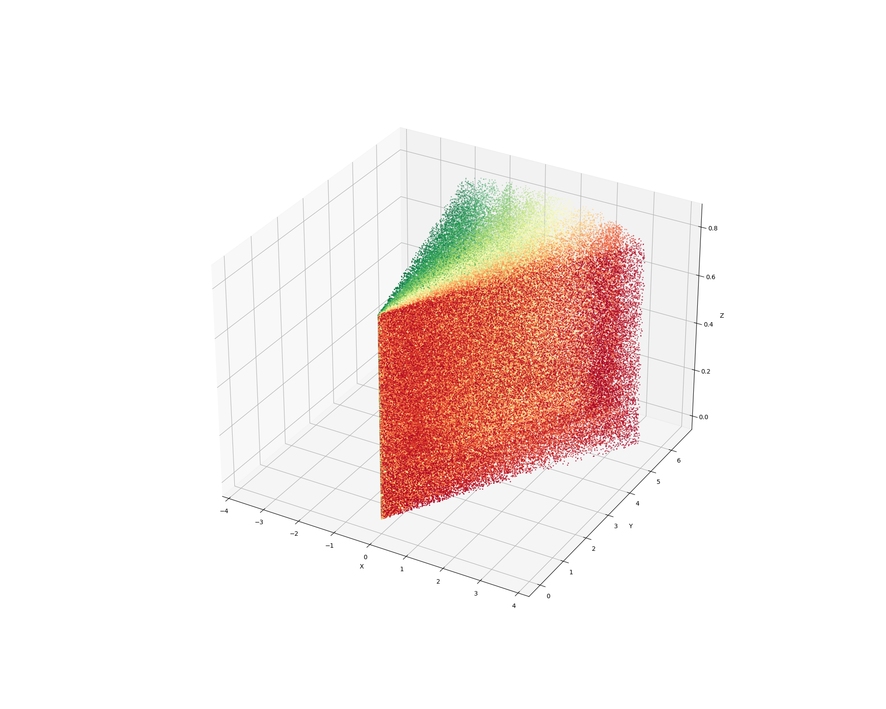

# lidar-anode

Софт для управления кареточками и лидарчиками без костылей, с блекджеком и асинхронностью



## Requirements

- python ~= 3.8
- pyserial==3.5
- pydantic~=2.6.1
- aiofiles~=23.2.1 (for tests)
- matplotlib~=3.7.5 (for tests)
- numpy~=1.24.4 (for tests)
## Installation

Установите, клонировав репозиторий и установив зависимости из requirements.txt

```bash
    git clone https://github.com/arud3nko/lidar-anode.git
    (venv: python3.8) pip install -r requirements.txt
```
    
## Demo

Пример использования ПС реализован в main.py\
Здесь запускается таск для одного лидара и соответсвующий ему обработчик сообщений. После обработки всех полученных сообщений отрисовывается трехмерный график.

**Для запуска main.py необходимо запустить тестовый сокет-сервер**


## Usage/Examples

Основной функционал ПС реализован в app/api.py

Запуска указанных функций будет достаточно для получения и обработки сообщений с лидаров.

    1) Создаем N очередей asyncio.Queue
    2) Создаем N задач для lidar_worker
    3) Создаем N задач для process_messages
    4) Запускаем задачи соответственно очередности создания (при N > 1 работать с результатами process_messages нужно соответствующим образом)
    * N - кол-во лидаров

**Подглядеть типы, возвращаемые ПС после обработки сообщений лидаров можно в process_messages**

```python
async def lidar_worker(number: int,
                       ip: str,
                       port: int,
                       message_queue: Queue) -> ...:
    """

    Lidar coroutine worker

    :param number: Номер лидара
    :type number: int
    :param ip: IP лидара
    :type ip: str
    :param port: Порт лидара
    :type port: int
    :param message_queue: Асинхронная очередь для записи полученных с лидара сообщений
        - разные очереди для разных лидаров!
    :type message_queue: Queue
    :return:
    :rtype:
    """

async def process_messages(message_queue: Queue,
                           callback: Optional[Callable[[List[tuple]], Awaitable[Any]]] = None) -> List[List[tuple]]:
    """

    Асинхронно обрабатывает попадающие в очередь сообщения
    При достижении таймаута прерывается - значит сообщения кончились

    :param message_queue: Очередь сообщений - разные очереди для разных лидаров!
    :type message_queue: Queue
    :param callback: Асинхронная callback-функция для каждого среза,
        в качестве аргумента обязательно принимающая список кортежей
        (тип, возвращаемый функцией-обработчиком)
    :type callback: Optional[Callable[[List[tuple]], Awaitable[Any]]]
    :return: Массив (для каждого среза) массивов кортежей с координатами точек
        [[(x, y, z), (x, y, z)], [(x, y, z)] ...]
    :rtype: List[List[tuple]]
    """
```